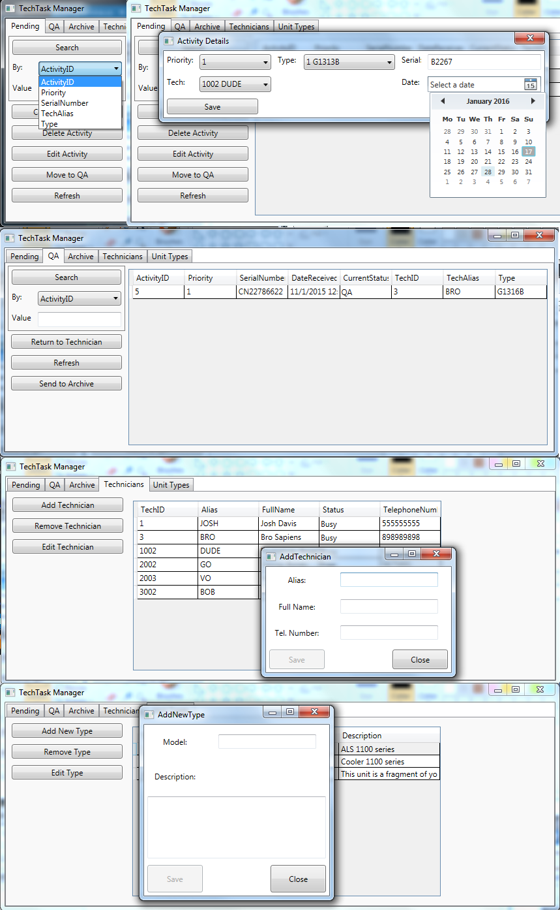

# TechTask-Manager

   An application for tracking repair activities in a Repair Center, inspired by my current job.
   The goal of this app is to track which technicians are currently available,
   delegate units awaiting repair to technicians and moving them to QA or Archive.
   
   Uses WPF for the UI.
   The database was designed using Entity Framework(Modelfirst)
   
   

   21.11.15 All basic functionally implemented
   Features to implement:
   Send Activity From QA to Archive
   Edit Technician
   Edit Unit Type

   18.11.15
   Implemented a Model First database
   Attached basic ViewModel for Activity tabs Pending, QA and Archive

   14.11.15
   This initial version contains only the placeholder UI.